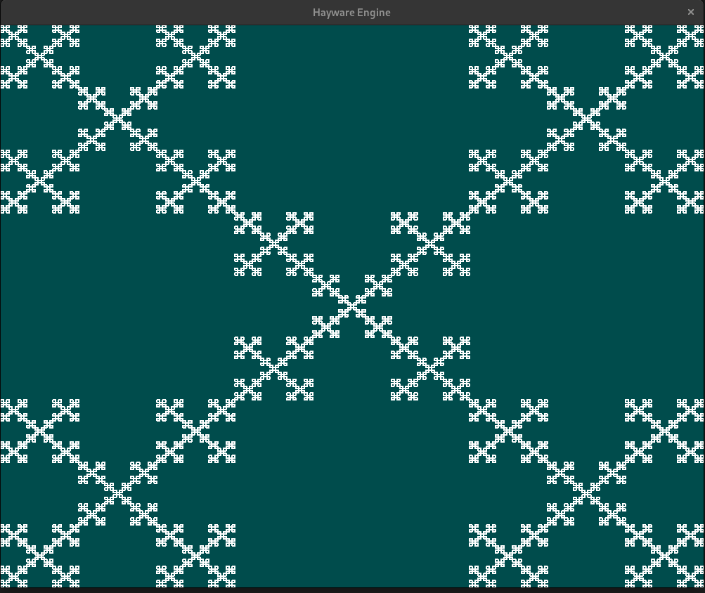

#Hayware Engine 2D
This is a simple and minimal game engine designed for learning more about OpenGL and graphics programming. The project serves as a personal learning tool to explore core concepts such as the rendering pipeline and working with OpenGL.
##Project overview
The engine is in its early stages of development and currently focuses on rendering with no GUI. Think of it as an alternative to the path tool in SVG.
##Key features (so far)
-Basic Rendering: By manipulating the VBO (Vertex Buffer Object), EBO (Element Buffer Object), and VAO (Vertex Array Object), you can draw on the screen.
-Shaders: The fragment and vertex shaders can be modified, and the changes will reflect in the engine.
-OpenGL and SDL3 Integration: The engine uses SDL3 for window creation and input handling, while OpenGL handles rendering.
##Demos
-Box Fractal Demo: A basic fractal is generated and rendered on the screen. (modify MIN_SIDE in demo.h to change the recursion depth)
Future demos will include more complex shapes, object interaction, and transformations.
##Purpose
This engine is not necessarily intended to be a full-fledged game engine but rather a learning tool for understanding the fundamentals of graphics programming. As such, it may not include features typically found in mature engines.
##Getting started
Installation:
###Prerequisites
-SDL3: The engine uses SDL3 for window creation and input handling.
-OpenGL: Ensure your system has OpenGL installed and is compatible with the version being used.
-GLEW: Required to load OpenGL functions that are not part of the base OpenGL specification but are commonly used in modern OpenGL development. It ensures compatibility with multiple versions of OpenGL across different systems.
###Future Prerequisites
As the engine evolves, additional tools will be needed, such as:
-CGLM: A math library for handling transformations, matrices, and vectors.
##Roadmap
-New demos
-Interaction with the user
-Improved shaders
##Contributing
Feel free to fork the repository, make changes, and submit pull requests! Contributions are welcome, especially if you have ideas to improve the engine or add more interesting demos.
##Images from demos

##TODO:
- [] Installation guide in README.md (Linux, Windows, macOS)
- [] Koch Fractal
- [] 3D Box Fractal